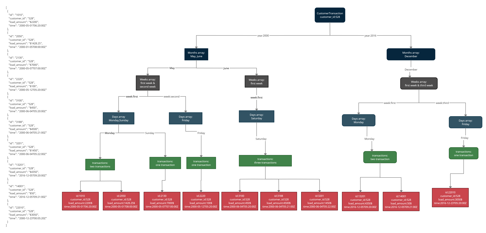

# velocityLimits
 In finance, it's common for accounts to have so-called "velocity limits". In this task, you'll write a program that accepts or declines attempts to load funds into customers' accounts in real-time.

Each attempt to load funds will come as a single-line JSON payload, structured as follows:

```json
{
  "id": "1234",
  "customer_id": "1234",
  "load_amount": "$123.45",
  "time": "2018-01-01T00:00:00Z"
}
```

Each customer is subject to three limits:

- A maximum of $5,000 can be loaded per day
- A maximum of $20,000 can be loaded per week
- A maximum of 3 loads can be performed per day, regardless of amount

As such, a user attempting to load $3,000 twice in one day would be declined on the second attempt, as would a user attempting to load $400 four times in a day.

For each load attempt, you should return a JSON response indicating whether the fund load was accepted based on the user's activity, with the structure:

```json
{ "id": "1234", "customer_id": "1234", "accepted": true }
```

You can assume that the input arrives in ascending chronological order and that if a load ID is observed more than once for a particular user, all but the first instance can be ignored. Each day is considered to end at midnight UTC, and weeks start on Monday (i.e. one second after 23:59:59 on Sunday).

Your program should process lines from `input.txt` and return output in the format specified above, either to standard output or a file. Expected output given our input data can be found in `output.txt`.

You're welcome to write your program in a general-purpose language of your choosing, but as we use Go on the back-end and TypeScript on the front-end, we do have a preference towards solutions written in Go (back-end) and TypeScript (front-end).

We value well-structured, self-documenting code with sensible test coverage. Descriptive function and variable names are appreciated, as is isolating your business logic from the rest of your code.

# My solution step by step:
1.Step one: read all transaction. e.g.
```json
[
  {
    "id": "1010",
    "customer_id": "528",
    "load_amount": "$2200",
    "time": "2000-05-01T06:20:00Z"
  },
  {
    "id": "2050",
    "customer_id": "528",
    "load_amount": "$1428.25",
    "time": "2000-01-05T08:00:00Z"
  },
  {
    "id": "2130",
    "customer_id": "528",
    "load_amount": "$7000",
    "time": "2000-05-07T07:00:00Z"
  },
  {
    "id": "2220",
    "customer_id": "528",
    "load_amount": "$100",
    "time": "2000-05-12T05:20:00Z"
  },
  {
    "id": "3100",
    "customer_id": "528",
    "load_amount": "$450",
    "time": "2000-06-04T05:20:00Z"
  },
  {
    "id": "3188",
    "customer_id": "528",
    "load_amount": "$4500",
    "time": "2000-06-04T05:21:00Z"
  },
  {
    "id": "3201",
    "customer_id": "528",
    "load_amount": "$1450",
    "time": "2000-06-04T05:22:00Z"
  },
  {
    "id": "13201",
    "customer_id": "528",
    "load_amount": "$4350",
    "time": "2016-12-05T09:20:00Z"
  },
  {
    "id": "14001",
    "customer_id": "528",
    "load_amount": "$50",
    "time": "2016-12-05T09:21:00Z"
  },
  {
    "id": "22010",
    "customer_id": "528",
    "load_amount": "$3050",
    "time": "2016-12-23T00:05:20Z"
  }
  {
      "id": "52010",
    "customer_id": "876",
    "load_amount": "$250",
    "time": "2017-10-23T00:05:20Z"
  },
  {
  ...
  }]
```
2.Step two: create a tree per customer base on above transactions. e.g.



3.Step three: evaluate all tree (tree = customer transactions) base on velocity limits.

4.Last step: print all transaction with status that shows every transaction is accepted or not.

# Runs commands:

1. run test: Jest framework : npx jest
2. compile typescripts: tsc app.ts --watch
3.

