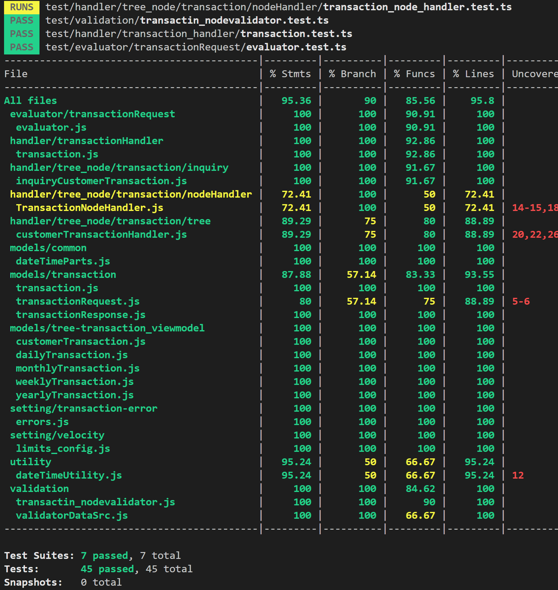

# velocityLimits
 In finance, it's common for accounts to have so-called "velocity limits". In this task, you'll write a program that accepts or declines attempts to load funds into customers' accounts in real-time.


# My solution step by step:
1.Step one: read all transaction. e.g.
```json
[
  {
    "id": "1010",
    "customer_id": "528",
    "load_amount": "$2200",
    "time": "2000-05-01T06:20:00Z"
  },
  {
    "id": "2050",
    "customer_id": "528",
    "load_amount": "$1428.25",
    "time": "2000-01-05T08:00:00Z"
  },
  {
    "id": "2130",
    "customer_id": "528",
    "load_amount": "$7000",
    "time": "2000-05-07T07:00:00Z"
  },
  {
    "id": "2220",
    "customer_id": "528",
    "load_amount": "$100",
    "time": "2000-05-12T05:20:00Z"
  },
  {
    "id": "3100",
    "customer_id": "528",
    "load_amount": "$450",
    "time": "2000-06-04T05:20:00Z"
  },
  {
    "id": "3188",
    "customer_id": "528",
    "load_amount": "$4500",
    "time": "2000-06-04T05:21:00Z"
  },
  {
    "id": "3201",
    "customer_id": "528",
    "load_amount": "$1450",
    "time": "2000-06-04T05:22:00Z"
  },
  {
    "id": "13201",
    "customer_id": "528",
    "load_amount": "$4350",
    "time": "2016-12-05T09:20:00Z"
  },
  {
    "id": "14001",
    "customer_id": "528",
    "load_amount": "$50",
    "time": "2016-12-05T09:21:00Z"
  },
  {
    "id": "22010",
    "customer_id": "528",
    "load_amount": "$3050",
    "time": "2016-12-23T00:05:20Z"
  }
  {
      "id": "52010",
    "customer_id": "876",
    "load_amount": "$250",
    "time": "2017-10-23T00:05:20Z"
  },
  {
  ...
  }]
```
2.Step two: create a tree per customer base on above transactions. e.g.


3.Step three: evaluate input customer transactions (is accepted or not) base on the rules (velocity limits).

4.Last step: print all transactions with status that shows every transaction is accepted or not.

# Runs commands:

1. run test: Jest framework : npx jest  / npx jest --coverage
2. compile typescripts to js: tsc app.ts --watch
3. run app: app.js run to show output (transactionResponse) : nodemon app.js



